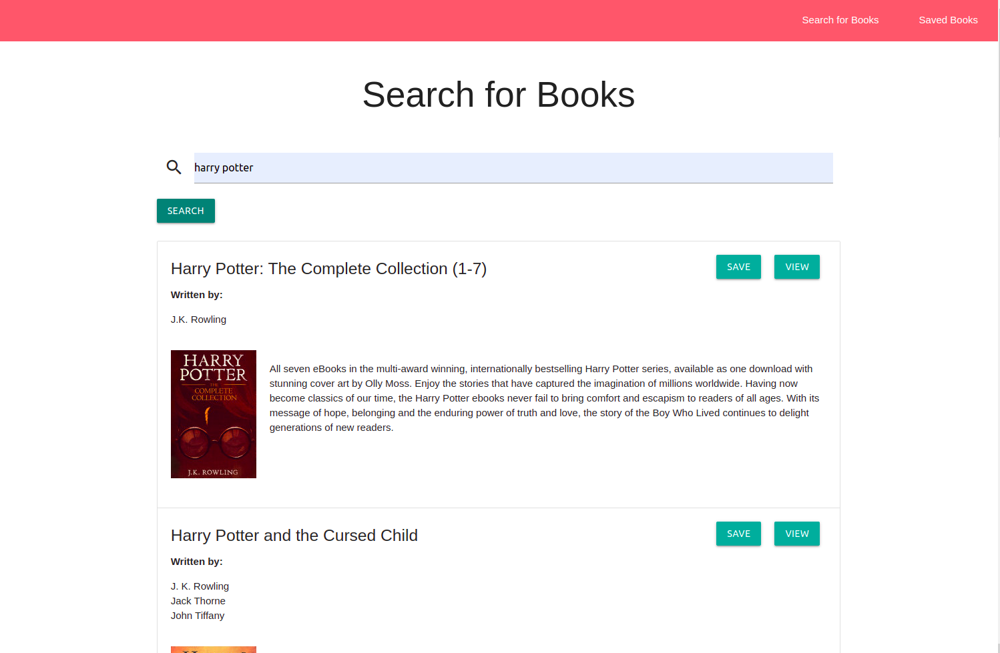
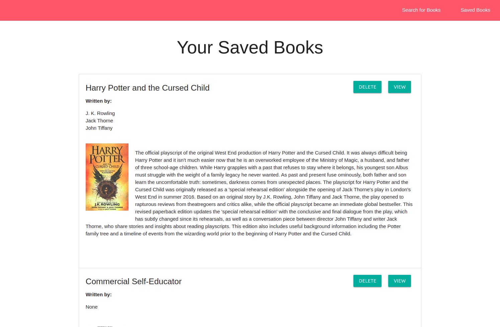

# Google Books Search

Another React website! This project is my first full stack react web application. The user can search for a book using the Google Book API and be presented a list of book titles, images, authors, and a description. Then the user can save the books to a database for later use.

This project also uses [Socket.io](https://socket.io/) to alert all users across different windows when a book has been saved or deleted.

## Built With
* [ReactJS](https://reactjs.org/)
* [Materialize CSS](https://materializecss.com/)
* [Google Books API](https://developers.google.com/books)
* [ExpressJS](https://expressjs.com/)
* [Axios](https://www.npmjs.com/package/axios)
* [MongooseJS](https://mongoosejs.com/)
* [MongoDB](https://www.mongodb.com/)
* [Socket.io](https://socket.io/)

# Table of Contents
  1. [Installation](#Installation)
  2. [Usage](#Usage)
  3. [License](#License)
  4. [Contributing](#Contributing)
  6. [Questions](#Questions)

  ## Installation
  Clone this repository, make sure to install all npm dependencies by running "npm i" in your terminal then run "npm start".

  ## Usage
  If you would like to try out a live version of the website click the link below.

## Link to Site

[Click to access the deployed site!](https://books-search-pfvatterott.herokuapp.com/)

## Screenshots

    

## Authors

### Paul Vatterott
[Github](https://github.com/pfvatterott)  
Email: pfvatterott@gmail.com

## License
MIT License

Copyright (c) 2021 Paul Vatterott

Permission is hereby granted, free of charge, to any person obtaining a copy of this software and associated documentation files (the "Software"), to deal in the Software without restriction, including without limitation the rights to use, copy, modify, merge, publish, distribute, sublicense, and/or sell copies of the Software, and to permit persons to whom the Software is furnished to do so, subject to the following conditions:

The above copyright notice and this permission notice shall be included in all copies or substantial portions of the Software.

THE SOFTWARE IS PROVIDED "AS IS", WITHOUT WARRANTY OF ANY KIND, EXPRESS OR IMPLIED, INCLUDING BUT NOT LIMITED TO THE WARRANTIES OF MERCHANTABILITY, FITNESS FOR A PARTICULAR PURPOSE AND NONINFRINGEMENT. IN NO EVENT SHALL THE AUTHORS OR COPYRIGHT HOLDERS BE LIABLE FOR ANY CLAIM, DAMAGES OR OTHER LIABILITY, WHETHER IN AN ACTION OF CONTRACT, TORT OR OTHERWISE, ARISING FROM, OUT OF OR IN CONNECTION WITH THE SOFTWARE OR THE USE OR OTHER DEALINGS IN THE SOFTWARE.

  ## Contributing
  Please feel free to contribute! Reach out to me through my email or Github listed below

  ## Questions

  If you have any questions please reach out through email or Github.  
  My email is pfvatterott@gmail.com  
  My Github can be accessed [here](https://github.com/pfvatterott)

